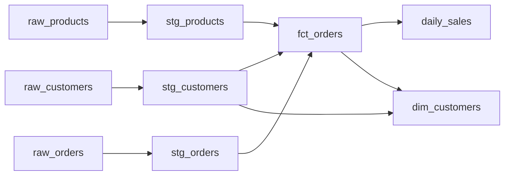

# Coffee Shop Analytics (dbt + Snowflake)

[](https://github.com/sebastianmukuria/dbt-snowflake-pipeline/actions/workflows/dbt.yml)

I built this to learn dbt and Snowflake. It's a small pipeline for a made-up coffee
shop: raw data about customers, products, and orders gets loaded into Snowflake, and
dbt turns it into clean tables you could put a dashboard on top of.

## What it does

The raw data starts as CSV files. dbt loads them into Snowflake and then builds two
layers on top:

- **staging** — one cleaned-up view per raw table (rename columns, fix types)
- **marts** — the tables you'd actually query: an order-line fact table, a daily sales
  summary, and a customer table with lifetime spend



`fct_orders` and `dim_customers` make a star schema (a fact table plus a dimension).
`daily_sales` is just revenue rolled up per day.

## Stack

Snowflake, dbt, SQL, a bit of Python to generate the sample data, and GitHub Actions
to run the build on every push.

## The data

The sample data is fake. A Python script
([`scripts/generate_seed_data.py`](scripts/generate_seed_data.py)) generates it with a
fixed random seed, so anyone who runs it gets the same numbers.

| Table | One row per | Rows |
|---|---|---|
| raw_customers | customer | 50 |
| raw_products | menu item | 15 |
| raw_orders | order line | 600 |

It covers about six months of orders across four cities and three product categories.

## Running it

You need a Snowflake account and dbt (`pip install dbt-snowflake`).

```bash
# 1. In a Snowflake worksheet, run data_pipeline/snowflake_setup.sql once
#    (creates the warehouse, database, and role). Set your username in it first.

# 2. Put your account + login in ~/.dbt/profiles.yml, then check the connection:
cd data_pipeline
dbt debug

# 3. Build everything
dbt seed     # load the CSVs into Snowflake
dbt build    # run the models and tests

# 4. Optional: open the docs and lineage graph in a browser
dbt docs generate && dbt docs serve
```

That builds 6 models and runs 20 tests.

## A few notes

- The tests are the `_*.yml` files next to the models plus one custom SQL test in
  `tests/`. They check things like "every order id is unique" and "category is always
  one we expect," and they run as part of `dbt build`.
- It connects to Snowflake with key-pair auth instead of a password, because my account
  has MFA turned on and that blocks plain password login.
- [`LEARNING_GUIDE.md`](LEARNING_GUIDE.md) is my notes on what each tool in the stack
  actually does, written while I was figuring it out.
