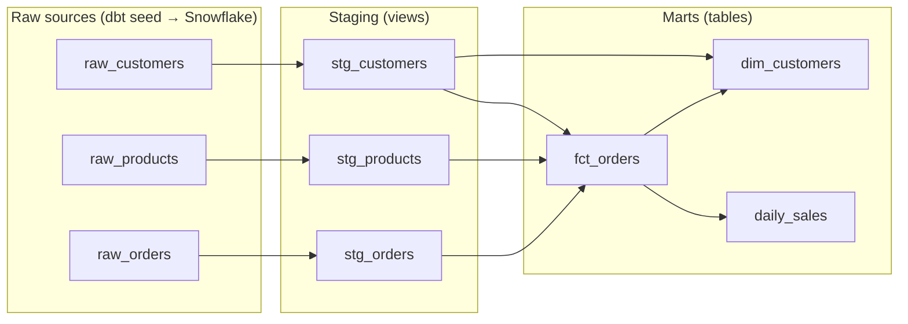

# ☕ Coffee Shop Analytics — dbt + Snowflake Pipeline

[](https://github.com/sebastianmukuria/dbt-snowflake-pipeline/actions/workflows/dbt.yml)

An end-to-end analytics-engineering project: raw operational data is loaded into
**Snowflake**, transformed with **dbt** into clean, tested, documented tables, and
exposed as analytics-ready marts for a BI tool. Built with software-engineering
practices throughout — modular SQL, data tests, and version control.

**Stack:** Snowflake · dbt (dbt-snowflake) · SQL · Git · Python (data generation) · Sigma-ready marts

---

## What this demonstrates

- **Dimensional modeling** — a star schema with a `fct_orders` fact table (grain: one
  order line) and a `dim_customers` dimension.
- **Layered dbt project** — `sources → staging → marts`, with staging materialized as
  views and marts as tables.
- **Sources** — raw tables declared as dbt `source()`s (the production pattern), so the
  transformation layer is decoupled from how raw data arrives.
- **Testing** — 20 data tests (`unique`, `not_null`, `relationships`, `accepted_values`,
  plus a custom singular test) that gate the build.
- **Reusable logic** — a macro (`calc_revenue`) and a surrogate key.
- **Reproducible data** — a seeded Python generator produces the raw CSVs.

## Data lineage



`fct_orders` (the facts) + `dim_customers` (the dimension) form a star schema;
`daily_sales` is a daily revenue rollup ready for dashboarding.

## Dataset

A synthetic coffee-shop chain generated by [`scripts/generate_seed_data.py`](scripts/generate_seed_data.py)
(fixed random seed → reproducible):

| Table | Grain | Rows |
|---|---|---|
| `raw_customers` | one per customer | 50 |
| `raw_products`  | one per menu item | 15 |
| `raw_orders`    | one per order line | 600 (≈430 tickets) |

Covers 6 months of orders (Jan–Jun 2024) across 4 cities and 3 product categories.

---

## Architecture

```
 Source systems        Ingestion           Snowflake                     BI
 (simulated)                              ┌───────────────────────┐
   CSV seeds  ──dbt seed──▶  raw tables ──┤ staging (views)        │──▶ Sigma /
   (POS, app)                             │   → marts (tables)     │    dashboards
                                          │   tested by dbt        │
                                          └───────────────────────┘
                          dbt (this repo) generates + runs all the SQL
```

In production the CSV-seed step would be an ingestion tool (Fivetran/Airbyte) loading
from real source systems; everything downstream of the raw tables is identical.

## Project layout

```
.
├── scripts/generate_seed_data.py     # reproducible raw-data generator
└── data_pipeline/                    # the dbt project
    ├── dbt_project.yml               # config: materializations, seed types
    ├── snowflake_setup.sql           # one-time warehouse/db/role setup
    ├── seeds/                        # raw_*.csv  (the raw layer)
    ├── models/
    │   ├── staging/                  # _sources.yml + stg_* views + _staging.yml tests
    │   └── marts/                    # fct_orders, daily_sales, dim_customers + tests
    ├── macros/calc_revenue.sql       # reusable revenue calc
    └── tests/                        # custom singular test
```

---

## Run it yourself

**Prerequisites:** a Snowflake account and `dbt-snowflake` (`pip install dbt-snowflake`).

```bash
# 1. One-time Snowflake setup: open data_pipeline/snowflake_setup.sql in a
#    Snowflake worksheet, set your username, and run it.

# 2. Configure ~/.dbt/profiles.yml with your account + auth, then:
cd data_pipeline
dbt debug         # verify the connection

# 3. (optional) regenerate the raw data
python ../scripts/generate_seed_data.py

# 4. Load raw data and build everything
dbt seed          # CSVs -> Snowflake raw tables
dbt build         # run all models + 20 tests, in dependency order

# 5. Explore the docs + interactive lineage graph
dbt docs generate && dbt docs serve
```

Expected result: **6 models built, 20 tests passing.**

---

## Notes

- **Auth:** this project connects to Snowflake via key-pair (RSA) authentication, which
  is required when the account enforces MFA — see `snowflake_setup.sql`.
- **Learning notes:** [`LEARNING_GUIDE.md`](LEARNING_GUIDE.md) breaks down each tool in the
  stack (what it is, how it's used here, why it matters).
